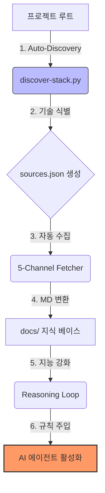

# 🚀 Tech Stack Organizer (Agentic Knowledge Engine)

> **"AI 에이전트의 기술적 한계를 뛰어넘어, 프로젝트 전용 지능을 구축하는 지식 자산화 엔진"**

[](https://opensource.org/licenses/MIT)
[](http://makeapullrequest.com)

---

## 🌟 개요 (Overview)

**Tech Stack Organizer**는 단순한 문서 수집기가 아닙니다. AI 에이전트(Antigravity, Cursor, Copilot 등)가 프로젝트의 기술 스택을 스스로 파악하고, 최신 공식 문서와 최고의 실천법(Best Practices)을 실시간으로 학습하여 **최적의 코딩 파트너**로 진화하게 만드는 **지능형 지식 플러그인**입니다.

### 💡 왜 이 도구가 필요한가요?
LLM은 학습 시점 이후의 최신 기술 변화를 알지 못하며, 개별 프로젝트의 특수한 라이브러리 조합을 즉시 이해하기 어렵습니다. 본 도구는 에이전트에게 **"실시간 데이터 시각"**과 **"프로젝트 맞문제 지식 베이스"**를 제공하여 추론 품질을 비약적으로 향상시킵니다.

---

## 🛠️ 핵심 메커니즘 (How it Works)



---

## 🚀 주요 기능 (Key Features)

| 기능 | 상세 설명 | 핵심 이점 |
| :--- | :--- | :--- |
| **자동 탐지 엔진** | `requirements.txt`, `package.json`, `Cargo.toml` 등을 스캔하여 기술 스택을 1초 만에 식별 | 수동 설정 없는 즉각적 가동 |
| **5중 지식 채널** | 공식 문서, GitHub, 레지스트리, 신규 제안서, 큐레이션 자료를 입체적으로 수집 | 파편화된 정보의 단일 창구화 |
| **멱등성 동기화** | MD5 해시 기반 지문 비교를 통해 변경된 내용만 효율적으로 업데이트 | 불필요한 트래픽 및 중복 제거 |
| **지능형 추론 루프** | LLM이 수집된 문서를 기반으로 아키텍처적 통찰과 에러 해결책을 지식화 | 단순 코드 작성을 넘어선 전략적 제언 |
| **제로 설정 규칙 주입** | 설치 즉시 시니어 아키텍트 페르소나와 작업 프로토콜을 에이전트에 자동 주입 | 일관성 있고 수준 높은 수행 보장 |

---

## 🚦 시작하기 (Quick Start)

### 1. 설치 (Installation)
타지 프로젝트의 `.agents` 폴더 내에 서브모듈로 추가하십시오. **표준 경로 준수가 필수적입니다.**
```powershell
# Standard Location: .agents/tech-stack-organizer
git submodule add https://github.com/savior714/tech-stack-organizer .agents/tech-stack-organizer
```

### 2. 환경 구축 (Bootstrapping)
자동 탐지 및 에이전트 전용 규칙(Rules)을 활성화합니다.
```powershell
python .agents/tech-stack-organizer/tools/automation/bootstrap-rules.py
```

### 3. 가동 (Run)
해당 폴더 진입 후 `start.bat`을 실행하거나 아래 명령을 통해 기술 스택 탐지를 시작합니다.
```powershell
python .agents/tech-stack-organizer/tools/automation/discover-stack.py
```

---

## 🤝 에이전트 협업 프로토콜 (Collaboration Protocol)

본 시스템을 운용하는 AI 에이전트들은 다음의 3대 원칙을 엄수합니다:
1. **Context Priority**: 모든 기술 배경지식은 서브모듈의 `docs/` 폴더를 최우선으로 참조합니다.
2. **Generalization Strictness**: 비즈니스 로직이 아닌 '기술적 사실'과 '범용 패턴'만을 관리하여 범용성을 유지합니다.
3. **Knowledge Loopback**: 해결된 이슈와 최적화 기법은 `{stack}/error-solutions.md`에 기록하여 팀의 자산으로 남깁니다.

---

## 📂 저장소 구조 (Domain Structure)

- **`docs/` (Knowledge Domain)**: 자동 생성된 기술 문서와 시스템 운영 지침(`CRITICAL_LOGIC.md`)
- **`tools/` (Automation Domain)**: 자동 탐지 및 수집을 담당하는 Python 엔진
- **`patterns/` (Standard Domain)**: 3-Layer 아키텍처 및 설계 표준 가이드라인
- **`config/` (Configuration Domain)**: 기술 스택별 추적 URL 및 메타데이터 제어

---

> **Note**: 본 프로젝트는 **Senior Full-stack Architect**의 페르소나를 가진 에이전트와 협업할 때 최대의 성과를 내도록 설계되었습니다. 에이전트에게 `docs/memory.md`를 먼저 읽도록 요청하세요.
